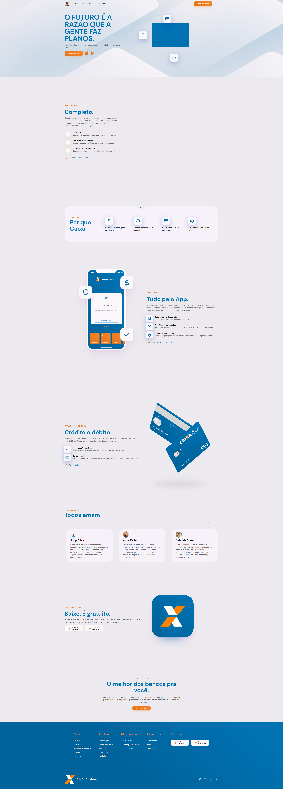

## Desktop

<h1 align="center">
    
</h1>

 

## ⚙️ Tecnologias

Este projeto foi desenvolvido utilizando:

- [HTML](https://developer.mozilla.org/pt-BR/docs/Web/HTML)
- [CSS](https://developer.mozilla.org/pt-BR/docs/Web/CSS)
- [JavaScript](https://developer.mozilla.org/pt-BR/docs/Web/JavaScript)

Bibliotecas:

- [AOS - Animate On Scroll](https://michalsnik.github.io/aos/)
- [Swiper](https://swiperjs.com/)
